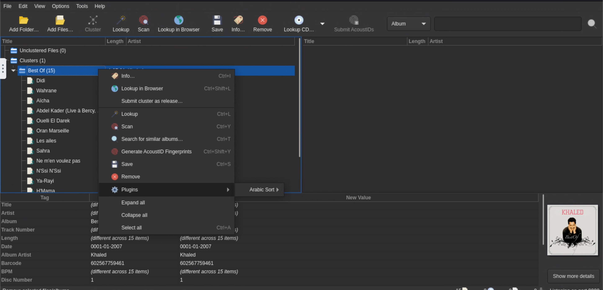
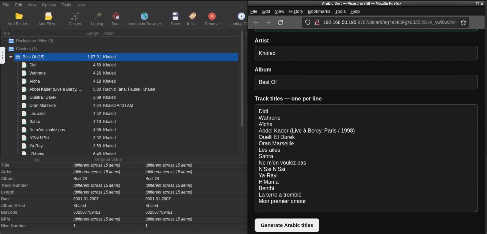
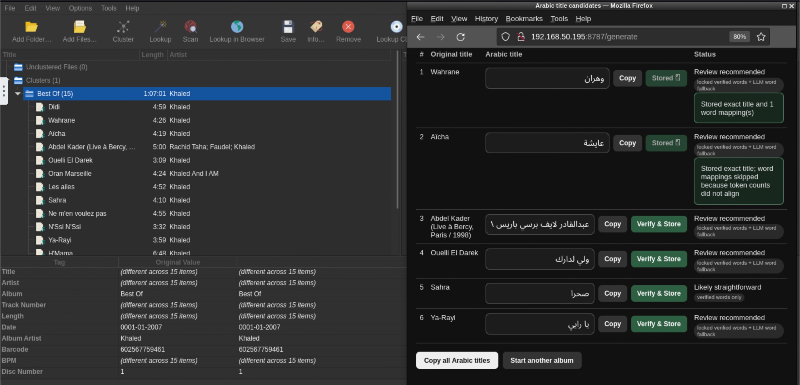
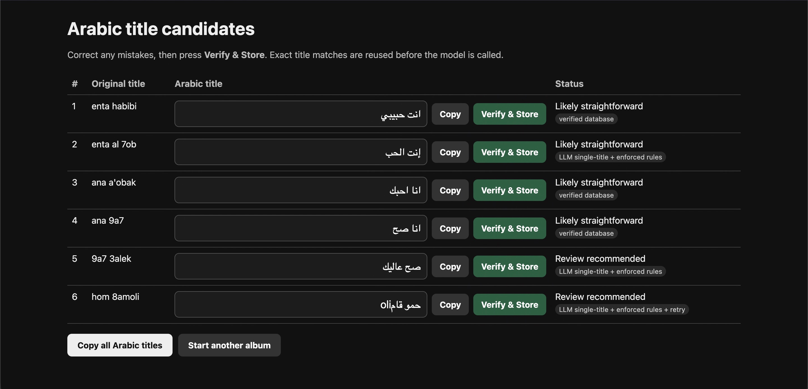

# Picard-Multilingual-Auto-Tagger
MusicBrainz Picard docker integration (plugin) for generating non-Latin track titles using a local LLM. 
For example arabic song title "al sahra" ->transliterate "restoring" to "الصحراء" another exapmle japanese song title "Ue o Muite Arukō" transliterate to "上を向いて歩こう" 

I originally built this for Arabic music, but the same idea could potentially be adapted for other languages and writing systems.

> This is an experimental community project and is not an official MusicBrainz Picard plugin.

## Why I made this

I use MusicBrainz Picard to organize my music library, but I often ran into the same problem: MusicBrainz may only have the English or Latin-script title for a track, even when the song is originally known in Arabic or another local language.

Doing this manually for every track takes a lot of time.

This project connects Picard to a small companion web app. The app receives the selected album and track metadata, sends it to a local Ollama model, and suggests localized titles that can be copied back into Picard.

## How it works

1. Right-click an album or track inside Picard.
2. Select the multilingual tagging plugin.
3. A small browser window opens from inside the Picard container.
4. The album, artist and track fields are populated automatically.
5. Click **Generate** to send the information to the local LLM.
6. Copy the suggested title and paste it into Picard.
7. When a suggestion is incorrect, edit it manually and click **Verify & Save**.

Verified corrections are stored in the local SQLite database. The next time the same title appears, the saved result can be reused instead of asking the LLM again.

## Screenshots

<!-- Upload your screenshots into a folder named screenshots and update these filenames. -->

### Open the plugin from Picard



### Metadata is automatically populated in the companion app



### Generate localized titles



### auto-tagger can also be used alone from web browser



## Current features

- Works from the Picard album and track context menu
- Automatically transfers selected Picard metadata to the companion app
- Uses a local Ollama model
- Supports album-level and individual-track generation
- Stores manually verified corrections in SQLite
- Reuses saved corrections without calling the LLM again
- Runs through Docker Compose
- Designed around the `jlesage/musicbrainz-picard` container

## Project structure

```text
.
├── auto-tagger/
│   ├── app/
│   │   ├── main.py
│   │   └── picard_prefill.py
│   ├── Dockerfile
│   └── requirements.txt
│
├── picard-plugin/
│   ├── arabic_tagging.zip
│   └── plugin_source/
│       └── arabic_tagging/
│           └── __init__.py
│
├── compose.yaml
└── compose.picard-example.yaml
```

Some internal names still use `arabic-sort` or `arabic_tagging` because the project was originally created specifically for Arabic. These names can be cleaned up in a future version.

## Requirements

- Docker and Docker Compose
- MusicBrainz Picard
- The `jlesage/musicbrainz-picard` Docker image
- Ollama
- A local Ollama model such as `qwen3:8b` the app have instruction to not use reasoning
- Enough memory to run the selected model

The supplied Compose file runs Ollama as part of the stack.

## Installation

Choose the installation method that fits your setup:

- **Docker Compose / command line:** continue with the instructions below.
- **Arcane:** see the [step-by-step Arcane installation guide](docs/INSTALL-ARCANE.md).

Check both provided Compose files before starting:

- `compose.yaml`
- `compose.picard-example.yaml`
  
### 1. Clone the repository

```bash
git clone https://github.com/ForeignWelcome/Picard-Multilingual-Auto-Tagger.git
cd Picard-Multilingual-Auto-Tagger
```
### 2. Edit `compose.yaml`

At minimum, change:

- The auto-tagger database path
- The Ollama model storage path
- `PUBLIC_BASE_URL`
- The timezone, user ID and group ID when needed

For example:

```yaml
PUBLIC_BASE_URL: http://192.168.1.100:8787
```

Replace the example address with the IP address of the Docker host.

### 3. Start the auto-tagger and Ollama

```bash
docker compose up -d --build
```

Pull the configured Ollama model:

```bash
docker exec -it arabic-sort-ollama ollama pull qwen3:8b
```

### 4. Update the Picard container

Use `compose.picard-example.yaml` as a reference.

The Picard container must include:

```yaml
environment:
  ARABIC_SORT_API_URL: http://arabic-sort:8787
  ARABIC_SORT_PUBLIC_URL: http://YOUR-SERVER-IP:8787
```

It must also be attached to the same Docker network:

```yaml
networks:
  - arabic-sort-network
```

At the bottom of the Picard Compose file:

```yaml
networks:
  arabic-sort-network:
    external: true
    name: arabic-sort-network
```

For Arabic text, the jlesage Picard container should also install an Arabic-capable font:

```yaml
INSTALL_PACKAGES: font-noto-arabic
```

### 5. Install the Picard plugin

The installable plugin archive is located at:

```text
picard-plugin/arabic_tagging.zip
```

the zip plugin must be copied to config directory of picard-jlisage "import" folder
After that open Picard and go to:

```text
Options → Plugins → Install Plugin
```

Select `arabic_tagging.zip`, enable the plugin, and restart Picard.

The editable source is available at:

```text
picard-plugin/plugin_source/arabic_tagging/__init__.py
```

## Important notes

- LLM-generated titles may be incorrect. this depends on the model and complexity of titles also i found out after saving corrections for more albums e.g 20, the workflow became much more usable because previously verified titles were reused from the database instead of being generated again  
- Review every suggested title before saving metadata.
- Do not expose Ollama or the auto-tagger service directly to the public internet without proper authentication and security.

## Current limitations

- Generated titles still have to be copied and pasted into Picard manually.
- The plugin is currently designed around the jlesage Docker version of Picard.
- The project has mainly been tested with Arabic.
- Metadata edge cases have not all been handled or tested.
- The code needs review and restructuring by an experienced Python developer.
- Installation is still more technical than I would like.

## Ideas for future development

- Add a button that writes the selected title directly into Picard after generation
- Support optional APIs such as OpenAI or Claude alongside local Ollama models
- Add proper language selection instead of assuming Arabic, maybe in "mode" or "language profile"
- Improve support for transliteration, translation and known localized titles
- Separate metadata parsing from LLM and database service calls
- Package the project as a more standard Picard plugin
- Improve Docker setup and documentation
- Rename the remaining Arabic-specific internal variables
- Explore whether the project could eventually be accepted into the official Picard plugin ecosystem

## Development help wanted

I am not a professional developer or programmer.

I built this because I could not find an existing solution for my multilingual music library, and the current version is working well in my own setup. A large part of it was created with AI-assisted coding, so I would really appreciate help from experienced developers who can review it, clean it up and make it more maintainable.

I am especially looking for someone interested in:

- Reviewing the current architecture
- Identifying security or reliability problems
- Refactoring the Python code
- Improving the Picard integration
- Defining a realistic first development milestone
- Helping turn this into a proper community-maintained project

Issues, suggestions and pull requests are welcome.

## Contributing

Before making a major change, please open an issue describing what you would like to work on.

For smaller fixes, documentation improvements and code cleanup, feel free to open a pull request directly.

Please keep changes focused and explain:

- What was changed
- Why it was changed
- How it was tested
- Whether it affects existing configuration or stored database entries

## License

This project is licensed under the MIT License.

## Acknowledgements

- MusicBrainz Picard
- The jlesage MusicBrainz Picard Docker image
- Ollama
- The open-source models used through Ollama

## Disclaimer

I do not present this as a polished app and as mentioned earlier this was mostly vibe coded thus looking for devs to improve it and take AI slop out of it as i am not a programmer  
